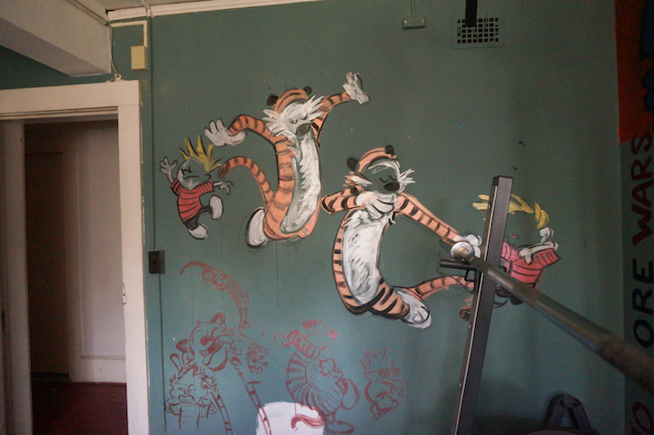

### The Telluride House
#### By Beatrice Jin

This is the Cornell Branch of the Telluride House. I lived here for two and half years (five semesters) during my undergrad. Among other things, Telluride has been called:

  * an "intellectual non-fraternity"
  * the "the happiest phase of my life"
  * "elitist", "inbred", "vanguardist"
  * "a club for smart kids"
  * "a structure of fairness needs to be so fucked up by Smirnoff and red wine that people stop thinking about fairness, goodness, and ethics, and only consider functional responsibility" [[1]](#notes)

Needless to say, it’s a contentious, yet mysterious spot on campus. I thought I’d give a digital tour of the place, hopefully clearing up some of the fog. 

Here's a floor plan of Telluride, obtained from the City of Ithaca. Standing at four stories, not including the attic, Telluride is a pretty grand place. It also offers a pretty grand scholarship up to five years of free room and board.

First up is the front porch - home to meals on warm afternoons, drinks on pretty much any night. You’ll have encountered this area at any of Telluride’s open events

Let’s go inside. This is the foyer, where we set up receptions and get our mail. 

Take a left; we’re at the living room. This room hasn’t changed much for the past 100 years. House members use this space for public speeches, cuddling, and general hangouts.

Two open doors and a secret door behind the projector screen lead to the music room and library. In my opinion, two of the most beautiful spaces, filled with old books, theses, encyclopedias, and records. 

The striped room looms on the other side of the foyer. Easily the most intense room - home to 5AM house meetings, heated arguments that have broken friendships. This is where all legislation is discussed and passed. 

Let's move on from the hard stuff. The way downstairs includes a non-functioning fireplace and some debate trophies.

The chalkboard still sports Trump jokes from November 2016.

This is the Dutch, another cuddle spot. House members might nap here between classes.

Pool games are competitive as ever. 

The gym remains mostly unused, save for two or three people. Its walls are well dressed, though. My own art covers three of the four walls (guess which). 

Ah, the dining room. Countless nights of drinking, allegedly intellectual discussions, spilled guacamole, broken glasses, incredibly well-prepared meals. Some of my best and worst memories are attached here. 

Carlos has fallen asleep on our old Steinway and Sons piano, which always seems to be out of tune. Let's leave him in peace...

A surprising amount of conversation is exchanged in the kitchen. But we have the most patient and generous workers. Thanks for keeping me in check and as our head chef says, "fattening us for the revolution."

Telluride has a food budget each year of about $77,000 USD. This covers three meals for every day of the week, with room for several friends and guests. Even so, there are leftovers. This was the food we had to throw away before winter break last year.

Back upstairs. These stain glass windows give the whole house a golden glow every evening. 

I never spent much time in the branch office. These computers aren't around anymore; they were found thrown in the gorge next door a couple months ago. 

You can see Cayuga lake from the balcony. Maybe smell some smoke too. 

We're blessed with massive bedrooms, even for doubles. 

Sometimes life just gets the best of you.

Here are some views I had from different bedroom windows throughout the semesters.

Another floor up and we're at the attic. Mostly used to store stuff, although rumored to have housed some hanky panky activities. 

Never mind that. This ladder leads to the roof...

...which unveils a unique and beautiful view of the city of Ithaca. A lot more can be said about that, but we can talk about it later. 

This is the way to class during winter and spring, otherwise known as the way out of Telluride. 

#### Notes
[1] Quotes from anonymous, Francis Perkins, William T. Vollmann, the 2013 Telluride Association's Convention Report, and Albert. 
This tour was inspired by Ben Welsh’s Twitter [tour](http://palewi.re/posts/2018/04/14/my-times/) of the LA Times’ downtown headquarters. The photographs in this piece were taken by me over the years of 2015-2018. Other embedded quotes and documents are from Cornell's Rare and Manuscript Collections, Denis Clark's master archive, and the City of Ithaca. 
