## The Telluride House
#### By Beatrice Jin

This is the Cornell Branch of the Telluride House. I lived here for two and half years (five semesters) during my undergrad. Among other things, Telluride has been called:

  * an "intellectual non-fraternity"
  * the "the happiest phase of my life"
  * "elitist", "inbred", "vanguardist"
  * "a club for smart kids"
  * "a structure of fairness needs to be so fucked up by Smirnoff and red wine that people stop thinking about fairness, goodness, and ethics, and only consider functional responsibility" [[1]](#notes)

Needless to say, it’s a contentious, yet mysterious spot on campus. I thought I’d give a digital tour of the place, hopefully clearing up some of the fog. 

Here's a floor plan of Telluride, obtained from the City of Ithaca. Standing at four stories, not including the attic, Telluride is a pretty grand place. It also offers a pretty grand scholarship up to five years of free room and board.

First up is the front porch - home to meals on warm afternoons, drinks on pretty much any night. You’ll have encountered this area at any of Telluride’s open events

Let’s go inside. This is the foyer, where we set up receptions and get our mail. 

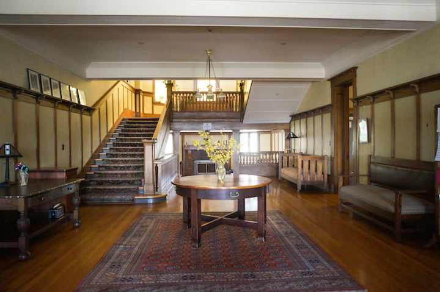
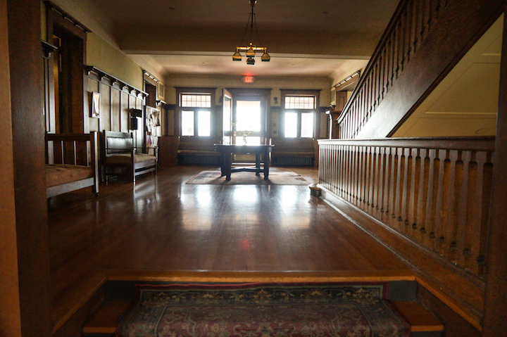

These phones are what really date this place (the House was first opened in 1911). 

Take a left; we’re at the living room. This room hasn’t changed much for the past 100 years. The second image here is a photograph of the same room circa 1912.

House members use this space for public speeches, cuddling, and general hangouts.

Two open doors and a secret door behind the projector screen lead to the music room and library.

They are full of books, encyclopedias, old records, dusty documents, and theses.

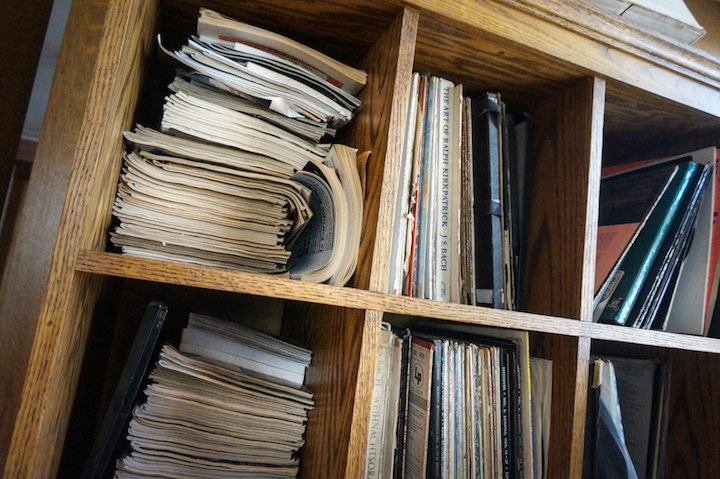

The striped room looms on the other side of the foyer. Easily the most intense room - home to 5AM house meetings, heated arguments that have broken friendships. This is where all legislation is discussed and passed. 

Let's move on from the hard stuff. We'll skip the elevator, which not a lot of people trust.

The way downstairs includes a non-functioning fireplace and some debate trophies.

The chalkboard used to sport Trump jokes from November 2016. Now it says, "Go where people sleep and see if they are safe" with an arrow pointing to it saying, "This is how you end up on an e-mail from Cornell Police."

This is the Dutch, another cuddle spot. House members might nap here between classes.

We've still got some Nintendo 64 games. 

Pool games are competitive as ever. 

Still trying to figure out what this is. 

The gym remains mostly unused, save for two or three people. Its walls are well dressed, though. My own art covers three of the four walls (guess which). 

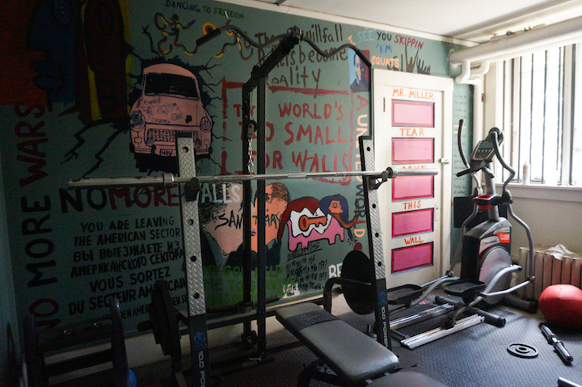

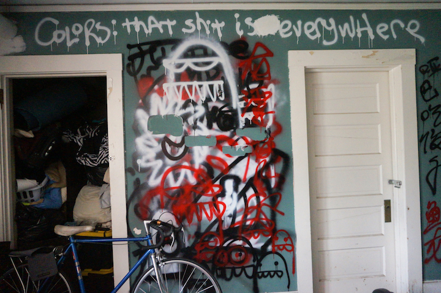

We'll pass briefly by the laundry room; also the source of endless toilet paper and paper towels. 

Ah, the dining room. Countless nights of drinking, allegedly intellectual discussions, spilled guacamole, broken glasses, incredibly well-prepared meals. Some of my best and worst memories are attached here. 

Weird stuff is always hanging out here: a catapult, untamed plants...

Carlos has fallen asleep on our old Steinway and Sons piano, which always seems to be out of tune. Let's leave him in peace...

A surprising amount of conversation is exchanged in the kitchen. But we have the most patient and generous workers. Thanks for keeping me in check and as our head chef says, "fattening us for the revolution."

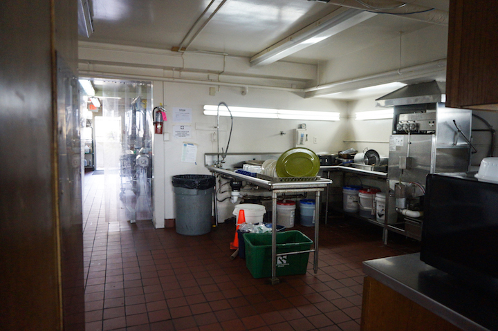
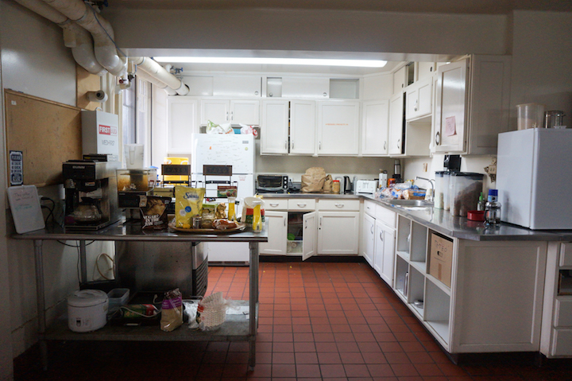
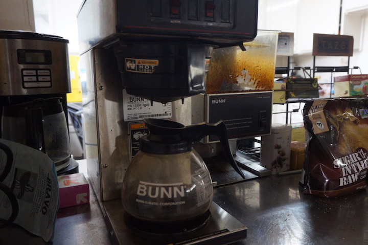

This is where we used to hide any hard liquor - now it's just oven cleaner.

Oven cleaner, for our industrial stove and equipment.

Telluride has a food budget each year of about $77,000 USD [[2]](#notes). This covers three meals for every day of the week, with room for several friends and guests. Even so, there are leftovers. This was the food we had to throw away before winter break last year.

Back upstairs. These stain glass windows give the whole house a golden glow every evening. 

We got some physics notation on the restroom sign.

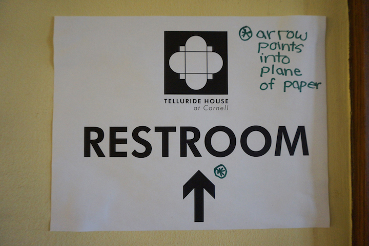

Remember not to get locked out on the side balcony.

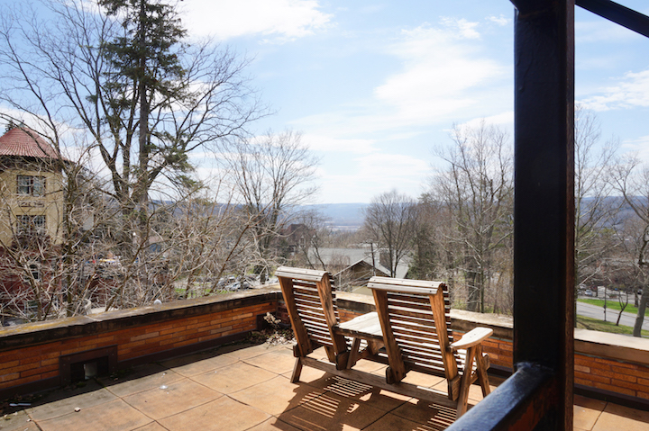

Just another broken wine glass chilling with the view. 

If you do get locked out, there's a fire escape to the floor above...

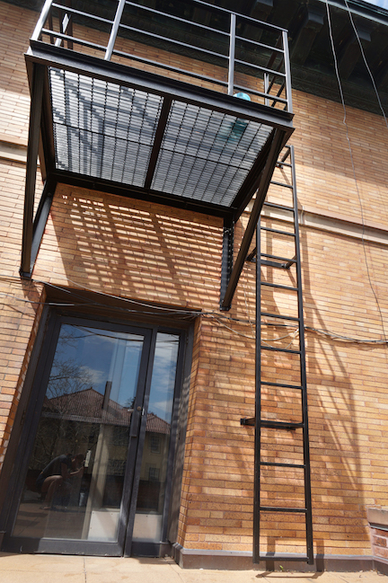
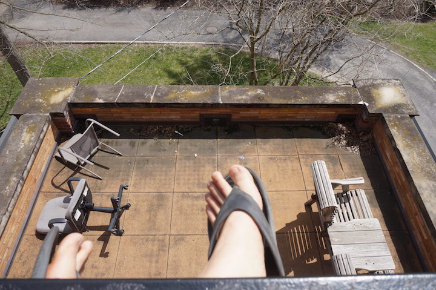

If only someone would let me in through the window.

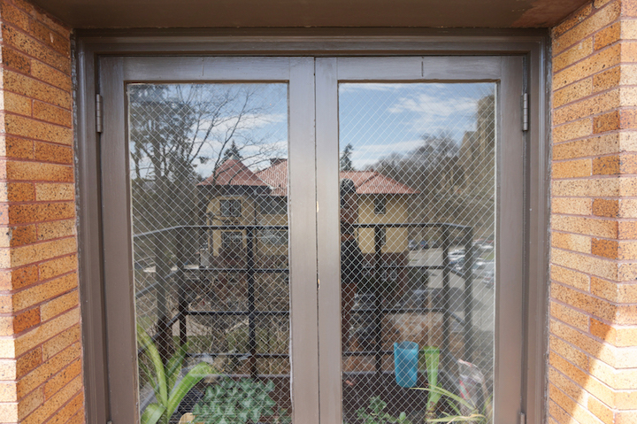

No one came. Back down we go. 

I never spent much time in the branch office. 

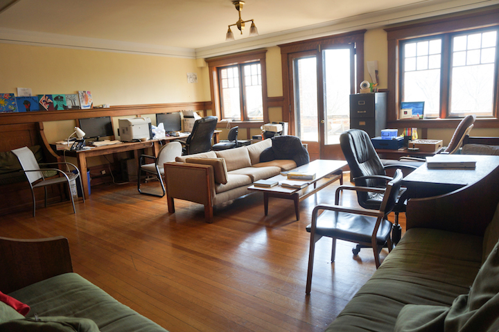

Those are new computers; the old ones were found thrown in the gorge next door a couple months ago. 

The office door beckons us to the balcony.

You can see a couple fraternities from the balcony. Maybe smell some smoke too. 

Since our previous House and Grounds committee left, the chairs have been left broken.

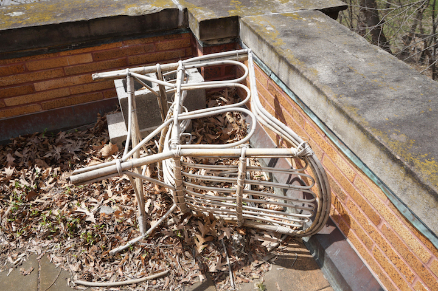

Like, really broken. 

We're blessed with massive bedrooms, even for doubles. 

Sometimes life just gets the best of you.

Here are some views I had from different bedroom windows throughout the semesters.

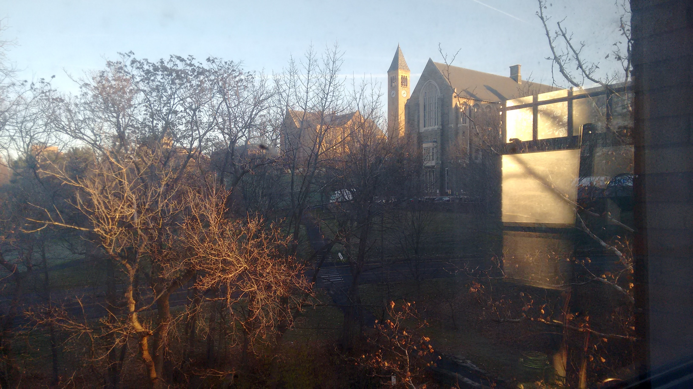

Outside the bedrooms we've got a staircase to the attic.

Mostly used to store stuff, although rumored to have housed some hanky panky activities. 

Never mind that. This ladder leads to the roof...

...which unveils a unique and beautiful view of the city of Ithaca. A lot more can be said about that, but we can talk about it later. 

This is the way to class during winter and spring, otherwise known as the way out of Telluride. 

#### Notes
[1] Quotes from anonymous, Francis Perkins, William T. Vollmann, the 2013 Telluride Association's Convention Report, and Albert. 

[2] In the 2016-17 school year,  $77,006 was appropriated to the Cornell Branch of the Telluride House for food. By early May, there was $23,267.78 left. Source: Telluride Association Proceedings of the 2016 Convention

This tour was inspired by Ben Welsh’s Twitter [tour](http://palewi.re/posts/2018/04/14/my-times/) of the LA Times’ downtown headquarters. The photographs in this piece were taken by me over the years of 2015-2018. Other embedded quotes and documents are from Cornell's Rare and Manuscript Collections, Denis Clark's master archive, and the City of Ithaca. 
